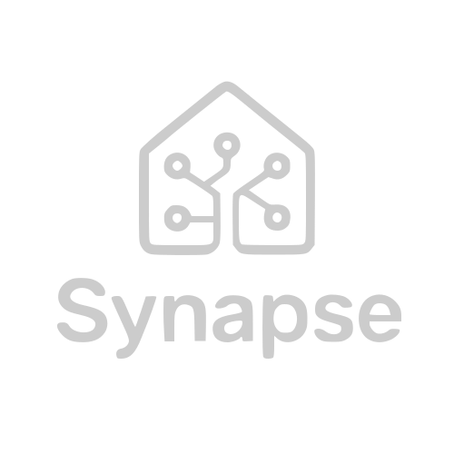

<div align="center">
  
</div>

# SynapseAPP

Proyecto de **Desarrollo de Aplicaciones Multiplataforma (DAM)**.  
Este proyecto es colaborativo y desarrollado por varios alumnos, dividido en **backend** (Spring Boot) y **frontend web** (React/Vite).

---

## 📌 Descripción

SynapseAPP es una aplicación que permite gestionar [usuarios, sesiones y datos de ejemplo / agrega aquí la descripción de tu proyecto].  

- **Backend:** implementado en Spring Boot, gestiona la lógica de negocio y la comunicación con la base de datos.  
- **FrontendWeb:** implementado en React con Vite, proporciona la interfaz de usuario y consume la API del backend.

---

## 🛠 Requisitos del proyecto

### Backend
- Java 17+
- Maven 3.8+ (o Gradle 7+ si usas Gradle)
- Spring Boot 3.x

### Frontend
- Node.js >= 20.0.0
- npm >= 9.0.0 (o yarn / pnpm)

---

## ⚙ Instalación

### Backend
```bash
cd backend
mvn clean install      # o ./gradlew build si usas Gradle
```  

### Frontend
```bash
cd frontendWeb
npm install           # o yarn install / pnpm install
``` 

## ▶ Ejecución

### Backend
```bash
cd backend
mvn spring-boot:run    # o ./gradlew bootRun
```  

### Frontend
```bash
cd frontendWeb
npm run dev            # o yarn dev / pnpm dev
```
## ⚠️ Normas del proyecto
- Cada miembro debe trabajar en su propia rama.
- Antes de hacer merge, actualizar desde `main`.

## 📚 Recursos

- [Documentación Spring Boot](https://spring.io/projects/spring-boot)  
- [Documentación React](https://reactjs.org/docs/getting-started.html)  
- [Documentación Vite](https://vitejs.dev/guide/)  